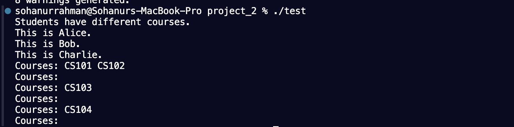

# C++ Object-Oriented Programming Project

## Introduction

This project demonstrates the implementation of an object-oriented programming (OOP) approach in C++. It consists of four main classes: **Person**, **Student**, **Teacher**, and **Course**. The program aims to simulate a basic educational system where students can enroll in courses, and teachers can manage the courses they teach. The use of inheritance, encapsulation, and polymorphism showcases the power of C++ in managing complex systems.

### Class Overview

1. **Person**
   - **Description**: This is the base class that represents a generic person. It provides common attributes and methods that can be inherited by the `Student` and `Teacher` classes.
   - **Attributes**:
     - `std::string name`: The name of the person.
     - `int age`: The age of the person.
   - **Methods**:
     - `virtual void printname()`: A virtual function that derived classes must implement to display the person's name.

2. **Student**
   - **Description**: This class inherits from the `Person` class and represents a student in the educational system. It includes functionality for managing a list of courses the student is enrolled in.
   - **Attributes**:
     - `string studentID`: A unique identifier for the student.
     - `vector<Course> enrolledCourses`: A list of courses the student is currently enrolled in.
   - **Methods**:
     - `void addCourse(Course c)`: Adds a course to the student's list of enrolled courses.
     - `void deleteCourse(Course c)`: Removes a course from the student's list of enrolled courses.
     - `void printCourses()`: Displays the courses the student is enrolled in.
     - `void printname() override`: Implements the base class method to display the student's name.

3. **Teacher**
   - **Description**: This class also inherits from the `Person` class and represents a teacher who instructs courses. It includes methods for managing the courses they teach.
   - **Attributes**:
     - `string salary`: The salary of the teacher.
     - `vector<Course> taughtCourses`: A list of courses the teacher is currently teaching.
   - **Methods**:
     - `void printCourses()`: Displays the courses taught by the teacher.
     - `void printname() override`: Implements the base class method to display the teacher's name.

4. **Course**
   - **Description**: This class represents a course offered in the educational system, containing all the necessary information about the course.
   - **Attributes**:
     - `string courseNumber`: A unique identifier for the course.
     - `string courseName`: The name of the course.
     - `std::string courseDescription`: A description of what the course covers.
   - **Methods**:
     - `void printCourseInfo()`: Displays the course's number, name, and description.

### Program Workflow

1. **Initialization**: The program begins by creating instances of the `Course`, `Student`, and `Teacher` classes. It initializes several courses with unique identifiers, names, and descriptions.

2. **Enrollment and Course Management**:
   - Students can enroll in courses using the `addCourse` method, which updates their list of enrolled courses.
   - Teachers can manage their courses similarly, using the `taughtCourses` attribute to track which courses they are responsible for.

3. **Operator Overloading**: The program implements operator overloading to compare students based on the number of courses they are enrolled in. This feature enhances the usability of the program and allows for custom comparisons.

4. **Polymorphism**: The program demonstrates runtime polymorphism by creating an array of `Person` pointers, which can reference both `Student` and `Teacher` objects. When the `printname` method is called, the appropriate derived class implementation is executed, showcasing the dynamic binding feature of C++.

## Output Screenshots and Explanations

### Screenshot 1: Program Execution

 

#### Explanation

The program initializes various courses, students, and teachers. After adding courses to the students and teachers, it demonstrates operator overloading by comparing students based on their course enrollments. The program also showcases runtime polymorphism by calling the `printname` method on an array of `Person` pointers, which refers to both `Student` and `Teacher` objects.


## Conclusion

This project effectively illustrates the fundamental concepts of object-oriented programming in C++. By utilizing classes and inheritance, the code manages the complexity of an educational system efficiently. The use of virtual functions and operator overloading enhances flexibility and usability, demonstrating how C++ can be leveraged to build robust applications.


## How to Run

To compile and run this project, use the following commands:

```bash
clang++ -o test person.cpp student.cpp teacher.cpp course.cpp test.cpp
./test
